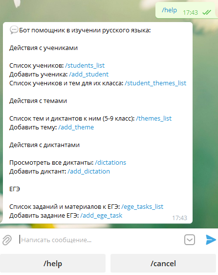
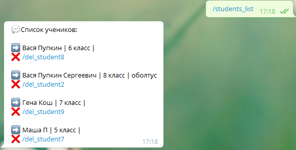
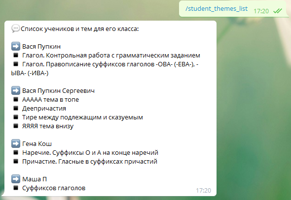
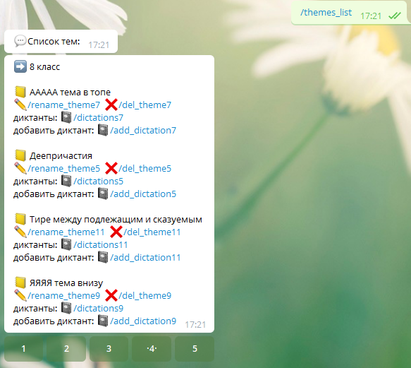
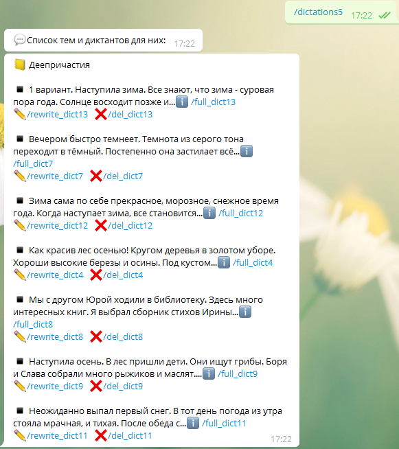
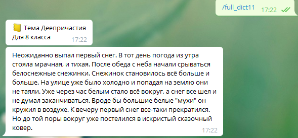
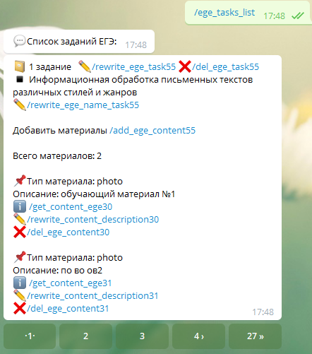
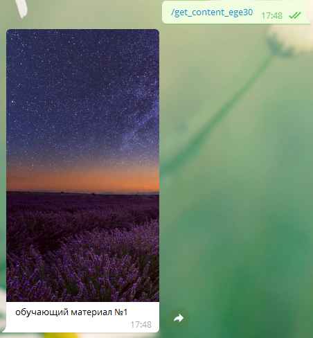

## О боте
#### Бот предназначен для помощи репетитору по русскому языку.
  
- #### Можно вести список учеников и классов, в которых они обучаются
  
- #### Выводить список учеников и их тем, в соответствии с их классом
  
- #### Вести список диктантов и добавлять их в темы, с последующей пересылкой диктантов ученикам
  
  
  
- #### Для заданий ЕГЭ можно добавлять обучающие материалы: фото и документы, с последующей пересылкой ученикам. Переименовывать практически всё, удалять контент
  
  
  
## Инструкция по установке
В переменных окружения надо проставить API токен бота.

`TELEGRAM_API_TOKEN` — API токен бота

`TELEGRAM_ACCESS_ID` — ID Telegram аккаунта, от которого будут приниматься сообщения (сообщения от остальных аккаунтов игнорируются)

Использование с Docker показано ниже.
- Предварительно заполните ENV переменные, указанные выше, в Dockerfile
- В команде запуска укажите локальную директорию с проектом вместо `local_project_path`. SQLite база данных будет лежать в папке проекта `db/students.db`.

Создаём образ для нашего контейнера:
```
docker build -t tg_bot ./
```

Запускаем контейнер и мапим внутрь контейнера папку из хост машины для сохранения данных вне зависимости от контейнера:
```
docker run -d --name tg_bot_cont -v /local_project_path/db:/home/db tg_bot
```

Чтобы войти в работающий контейнер:
```
docker exec -ti tg_bot_cont bash
```

Войти в контейнере в SQL шелл:
```
docker exec -ti tg_bot_cont bash
sqlite3 /home/db/students.db
```

Удобство отображения таблиц в sqlite
```
.mode column
.headers on
```

Структура:
```
+---db                              # папка с БД
|       students.db                 # файл БД
|       
+---handlers                        # отправка команд в бота
|   |   common.py                   # основные
|   |   dictations.py               # диктанты
|   |   ege.py                      # егэ задания
|   |   share.py                    # общие функции
|   |   students.py                 # ученики
|   |   themes.py                   # темы классов
|   |   __init__.py
|   |   
+---modules                         # вспомогательные модули для handlers 
|   |   dictations_module.py
|   |   ege_module.py               
|   |   shared_module.py            # модуль для общих ф-ций
|   |   students_module.py           
|   |   themes_module.py            
|   |   __init__.py     
|       
|   .gitignore
|   createdb.sql                    # скрипт создания и наполенения таблицы
|   db.py                           # команды для взаимодействия с БД
|   Dockerfile
|   exceptions.py
|   middlewares.py                  # ограничения доступа
|   pip_requirements.txt            # зависимости
|   README.md
|   server.py                       # файл старта сервера
```